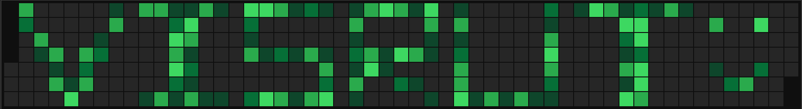

  

  

## 🙋‍♂️ About Me

- 📖 &nbsp;Computer Science undergraduate at **[Nanyang Technological University (NTU)](https://www.ntu.edu.sg/)**, Singapore.
- 🤖 &nbsp;Aspiring **software engineer & AI developer** — I like building systems that run themselves.
- 📈 &nbsp;Outside coursework I build **autonomous algorithmic-trading systems** (Python, ML, live market data) as a long-running personal project.
- 🌱 &nbsp;Currently going deep on **machine learning, quantitative modelling, and full-stack development**.
- ⚡ &nbsp;Fun fact: I'll happily spend 4 hours automating a 5-minute task, and I have.

 

## 💻 Tech Stack

**Languages**

**Web**

**Data &amp; ML**

 

## 🔧 Featured Projects

  
  

 

## 🐍 Watch the snake eat my contributions

  <picture>
    <source media="(prefers-color-scheme: dark)" srcset="https://raw.githubusercontent.com/visrutsuresh/visrutsuresh/output/github-snake-dark.svg" />
    <source media="(prefers-color-scheme: light)" srcset="https://raw.githubusercontent.com/visrutsuresh/visrutsuresh/output/github-snake.svg" />
    
  </picture>

 

## 📊 GitHub Stats

  
  

 

## 🤝 Connect

Thanks for stopping by ✨

